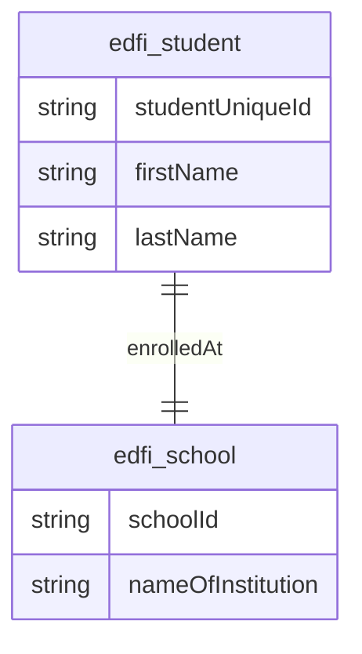
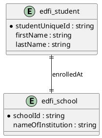
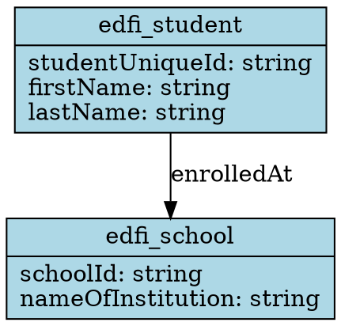
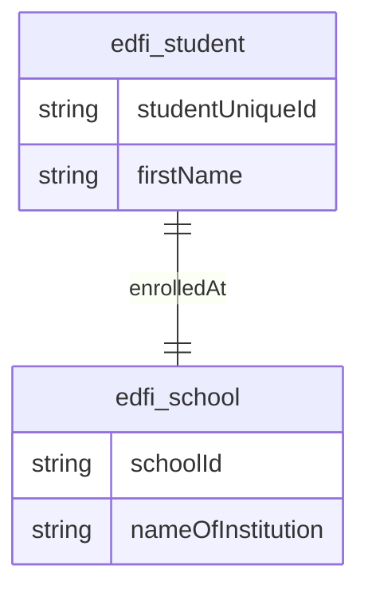

# Schema Visualization Guide

The Ed-Fi Data Standard MCP Server now includes powerful schema visualization capabilities that generate entity relationship diagrams from OpenAPI specifications.

## Available Visualization Tools

### 1. `generate_entity_diagram`

Generate entity relationship diagrams in multiple formats.

**Parameters:**
- `format` (optional): "mermaid", "plantuml", or "graphviz" (default: "mermaid")
- `includeProperties` (optional): Include entity properties (default: true)
- `includeDescriptions` (optional): Include entity descriptions (default: false)
- `filterDomains` (optional): Array of domain names to filter by
- `maxEntities` (optional): Maximum entities to include (default: 20)

**Example:**
```json
{
  "format": "mermaid",
  "filterDomains": ["student", "school"],
  "maxEntities": 15
}
```

### 2. `list_entity_relationships`

List relationships between entities in the schema.

**Parameters:**
- `entityName` (optional): Show relationships for specific entity
- `relationshipType` (optional): Filter by type ("one-to-one", "one-to-many", etc.)

### 3. `get_entities_by_domain`

Get entities grouped by domain areas (Student, School, Staff, Assessment, etc.).

**Parameters:**
- `domain` (optional): Get entities for specific domain only

### 4. `export_diagram_as_text`

Export diagram text that can be saved to a file.

**Parameters:**
- `format` (required): "mermaid", "plantuml", or "graphviz"
- `filename` (optional): Save to file in cache directory
- `filterDomains` (optional): Filter by domain areas
- `maxEntities` (optional): Limit number of entities (default: 15)

## Supported Diagram Formats

### Mermaid
Modern diagramming syntax supported by GitHub, GitLab, and many tools.

**Example Output:**


**Viewers:**
- GitHub/GitLab markdown
- [Mermaid Live Editor](https://mermaid.live/)
- VS Code Mermaid extension
- Many documentation platforms

### PlantUML
Mature diagramming language with extensive tooling support.

**Example Output:**


**Viewers:**
- [PlantUML Online Server](http://www.plantuml.com/plantuml/)
- IDE plugins (IntelliJ, VS Code, Eclipse)
- Command line tools

### Graphviz
Traditional graph visualization with precise layout control.

**Example Output:**


**Viewers:**
- [Graphviz Online](https://dreampuf.github.io/GraphvizOnline/)
- Local `dot` command
- Graphviz desktop applications

## Domain Filtering

The visualization tools automatically categorize entities into domain areas:

- **Student**: Student-related entities (enrollments, demographics, etc.)
- **School**: Educational institutions and organizational units
- **Staff**: Personnel and human resources
- **Assessment**: Testing and evaluation entities
- **Course**: Academic programs and curriculum
- **Grade**: Grading and academic progress
- **Attendance**: Attendance tracking
- **Other**: Miscellaneous entities not fitting other categories

Use the `filterDomains` parameter to focus on specific areas:

```json
{
  "format": "mermaid",
  "filterDomains": ["student", "assessment"],
  "maxEntities": 10
}
```

## Relationship Types

The tool identifies and visualizes different types of relationships:

- **One-to-One**: Single entity references (→)
- **One-to-Many**: Array properties referencing other entities (→○)
- **Many-to-One**: Multiple entities referencing same target (○→)
- **Many-to-Many**: Complex bidirectional relationships (○→○)

## Best Practices

### For Large Schemas
1. Use domain filtering to focus on specific areas
2. Limit entities with `maxEntities` parameter
3. Consider multiple smaller diagrams instead of one large diagram

### For Documentation
1. Use Mermaid for web-based documentation
2. Use PlantUML for detailed technical documentation
3. Export diagrams as images for presentations

### For Analysis
1. Start with `get_entities_by_domain` to understand structure
2. Use `list_entity_relationships` to identify key connections
3. Generate focused diagrams for specific domains

## Example Workflow

```javascript
// 1. Load Ed-Fi specification
await setDataStandardVersion("5.2");

// 2. Explore domain structure
await getEntitiesByDomain();

// 3. Generate student-focused diagram
await generateEntityDiagram({
  format: "mermaid",
  filterDomains: ["student", "school"],
  maxEntities: 12
});

// 4. Examine specific relationships
await listEntityRelationships({
  entityName: "edfi_student"
});

// 5. Export for documentation
await exportDiagramAsText({
  format: "plantuml",
  filename: "student-entities.puml",
  filterDomains: ["student"]
});
```

## Integration with Tools

### GitHub/GitLab
Save Mermaid diagrams directly in markdown files:

````markdown
## Student Entity Relationships


````

### Documentation Platforms
Most modern documentation platforms support Mermaid or PlantUML:

- GitBook
- Notion
- Confluence
- Sphinx
- MkDocs

### Development Tools
Use in VS Code, IntelliJ, or other IDEs with appropriate extensions for live preview and editing.