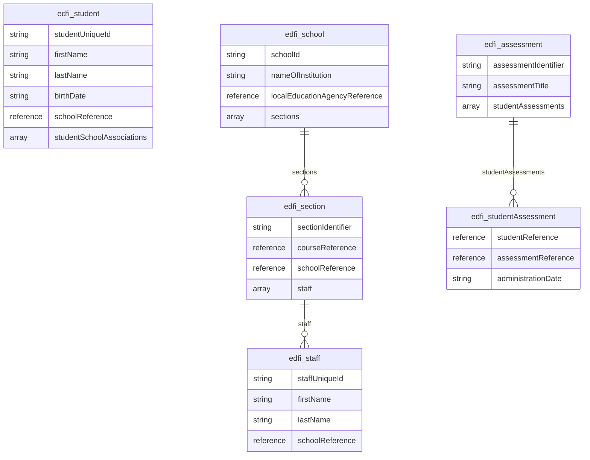
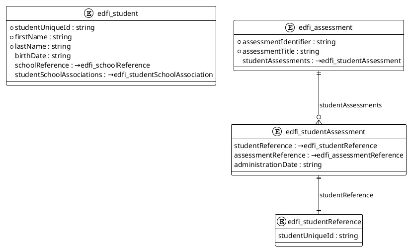
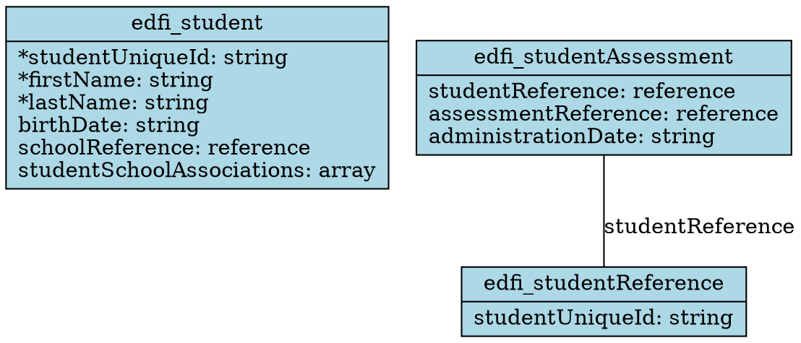

# Schema Visualization Examples

This document provides examples of the schema visualization capabilities added to the Ed-Fi Data Standard MCP Server.

## Example 1: Basic Entity Relationship Diagram

**Command:**

```json
{
  "tool": "generate_entity_diagram",
  "arguments": {
    "format": "mermaid",
    "maxEntities": 6
  }
}
```

**Generated Mermaid Diagram:**



## Example 2: Domain-Filtered Diagram

**Command:**

```json
{
  "tool": "generate_entity_diagram",
  "arguments": {
    "format": "plantuml",
    "filterDomains": ["student", "assessment"],
    "maxEntities": 8
  }
}
```

**Generated PlantUML Diagram:**



## Example 3: Entity Relationships Analysis

**Command:**

```json
{
  "tool": "list_entity_relationships",
  "arguments": {
    "entityName": "edfi_student"
  }
}
```

**Output:**

```
# Entity Relationships for edfi_student

Found 2 relationship(s):

• **edfi_student** → **edfi_schoolReference** (schoolReference)
  Type: one-to-one

• **edfi_student** →○ **edfi_studentSchoolAssociation** (studentSchoolAssociations)
  Type: one-to-many

## Legend:
• → : one-to-one
• →○ : one-to-many  
• ○→ : many-to-one
• ○→○ : many-to-many
```

## Example 4: Domain Organization

**Command:**

```json
{
  "tool": "get_entities_by_domain",
  "arguments": {}
}
```

**Output:**

```markdown
# Entities by Domain

## Student (3 entities)
• edfi_student
• edfi_studentAssessment
• edfi_studentReference

## School (2 entities)
• edfi_school
• edfi_schoolReference

## Staff (1 entities)
• edfi_staff

## Assessment (2 entities)
• edfi_assessment
• edfi_assessmentReference

## Course (1 entities)
• edfi_courseReference

## Other (2 entities)
• edfi_localEducationAgencyReference
• edfi_section

Use get_entities_by_domain with a specific domain name to see all entities in that domain.
```

## Example 5: Graphviz Export

**Command:**

```json
{
  "tool": "export_diagram_as_text",
  "arguments": {
    "format": "graphviz",
    "filterDomains": ["student"],
    "maxEntities": 5
  }
}
```

**Generated Graphviz Diagram:**



## Visual Representation Benefits

The schema visualization tools provide several key benefits for Ed-Fi data architects:

1. **Quick Understanding**: Visual diagrams make complex schema relationships immediately apparent
2. **Documentation**: Generated diagrams can be embedded in technical documentation
3. **Architecture Planning**: Understand data flow and dependencies between entities
4. **Training Materials**: Use diagrams to onboard new team members
5. **Data Governance**: Visualize data lineage and entity relationships
6. **Integration Planning**: Identify key entities and relationships for API integration

## Supported Viewers

### Mermaid Diagrams

- GitHub/GitLab (native rendering in markdown)
- [Mermaid Live Editor](https://mermaid.live/)
- VS Code with Mermaid extension
- Documentation platforms (GitBook, Notion, etc.)

### PlantUML Diagrams  

- [PlantUML Online Server](http://www.plantuml.com/plantuml/)
- IDE plugins (IntelliJ IDEA, VS Code, Eclipse)
- Command line tools (`plantuml`)
- Documentation generators

### Graphviz Diagrams

- [Graphviz Online](https://dreampuf.github.io/GraphvizOnline/)
- Local `dot` command (`dot -Tpng diagram.dot -o diagram.png`)
- Desktop applications (yEd, Gephi)
- Scientific and technical documentation tools

## Best Practices

1. **Start Small**: Begin with domain-filtered diagrams for focused analysis
2. **Iterative Exploration**: Use entity relationship listings to understand connections before generating large diagrams
3. **Documentation Integration**: Export diagrams in formats that match your documentation toolchain
4. **Multiple Perspectives**: Generate different views (by domain, by relationship type) for comprehensive understanding
5. **Regular Updates**: Regenerate diagrams when Ed-Fi specifications are updated to maintain accuracy
